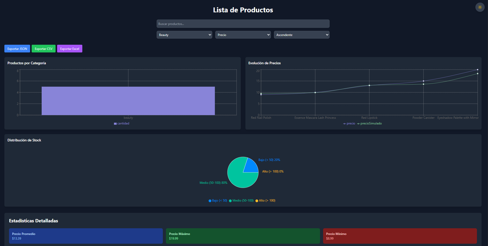

# Proyecto ABP

## Evidencia 1

### Lista de Productos con React + Vite

Este proyecto es una aplicación web que muestra una lista de productos consumiendo la API de DummyJSON. Está construido con React, Vite, Tailwind CSS y Axios.




### Tecnologías Utilizadas

- [React](https://reactjs.org/) - Biblioteca de JavaScript para construir interfaces de usuario
- [Vite](https://vitejs.dev/) - Herramienta de compilación que proporciona una experiencia de desarrollo más rápida
- [Tailwind CSS](https://tailwindcss.com/) - Framework de CSS utilitario
- [Axios](https://axios-http.com/) - Cliente HTTP para realizar peticiones a la API
- [DummyJSON](https://dummyjson.com/) - API de prueba para obtener datos de productos
- [Recharts](https://recharts.org/) - Biblioteca de gráficos para React
- [React-Toastify](https://fkhadra.github.io/react-toastify/) - Sistema de notificaciones
- [XLSX](https://github.com/SheetJS/sheetjs) - Biblioteca para manejo de archivos Excel
- [File-Saver](https://github.com/eligrey/FileSaver.js/) - Biblioteca para guardar archivos

### Requisitos Previos

- Node.js (versión 14.0.0 o superior)
- npm (incluido con Node.js)

### Instalación

Clona este repositorio o descárgalo:
```bash
git clone <https://github.com/Marioarce95/PI_Evidencias_2025.git>
```

### Navega al directorio del proyecto:

```bash
cd PI_Evidencias_2025
```

### Instala las dependencias:

```bash
npm install
```

### Para ejecutar el proyecto en modo desarrollo:

```bash
npm run dev
```

# EVIDENCIA 2

## División de Componentes

El proyecto se ha dividido en los siguientes componentes principales:

1. **ProductList**: 
   - Encargado de mostrar la lista de productos
   - Implementa paginación y lazy loading
   - Muestra 8 productos por página
   - Incluye navegación y animaciones de carga

2. **StatsPanel**: 
   - Muestra las estadísticas de los productos
   - Calcula y muestra estadísticas en tiempo real
   - Diseño con tarjetas de diferentes colores

3. **SearchBar**:
   - Componente para búsqueda y filtrado
   - Filtrado por categoría
   - Ordenamiento por precio y rating
   - Soporte para modo oscuro

4. **ThemeToggle**:
   - Botón flotante para cambiar entre modo claro y oscuro
   - Iconos dinámicos según el modo
   - Animaciones y transiciones suaves

5. **DetailedStats**:
   - Estadísticas generales y por categoría
   - Precios promedio, máximos y mínimos
   - Rating promedio y análisis de stock
   - Diseño responsive con grid

6. **DataVisualizations**:
   - Gráfico de barras para productos por categoría
   - Gráfico de líneas para evolución de precios
   - Gráfico circular para distribución de stock
   - Tooltips interactivos y leyendas

7. **ExportTools**:
   - Exportación a JSON, CSV y Excel
   - Manejo de errores y notificaciones
   - Interfaz intuitiva y responsive

## Características Implementadas

### Filtrado y Ordenamiento
- Búsqueda por texto
- Filtrado por categoría
- Ordenamiento por precio y rating
- Dirección de ordenamiento (ascendente/descendente)

### Estadísticas
- Precio promedio, máximo y mínimo
- Rating promedio
- Análisis de stock
- Estadísticas por categoría
- Productos destacados

### Visualizaciones
- Gráficos interactivos
- Actualización dinámica
- Soporte para modo oscuro
- Diseño responsive

### Exportación de Datos
- Formato JSON
- Formato CSV
- Formato Excel
- Notificaciones de éxito/error

### Modo Oscuro
- Cambio de tema persistente
- Transiciones suaves
- Adaptación de todos los componentes
- Preferencias del sistema

### Optimizaciones
- Carga perezosa de productos
- Paginación eficiente
- Manejo de errores mejorado
- Feedback visual constante

## Mejoras de Diseño

- Implementación de Tailwind CSS para diseño responsive
- Animaciones suaves en hover y transiciones
- Tarjetas con sombras y bordes redondeados
- Sección de estadísticas con fondos de colores distintivos
- Diseño adaptable a diferentes tamaños de pantalla
- Sistema de notificaciones integrado
- Indicadores de carga y feedback visual
- Jerarquía visual mejorada
